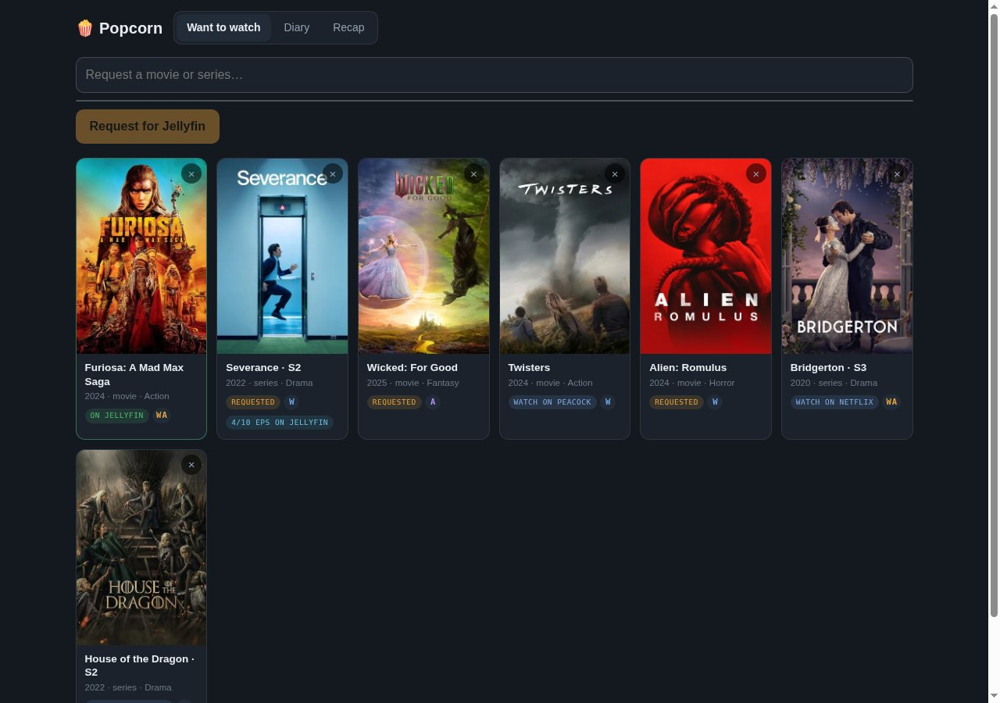
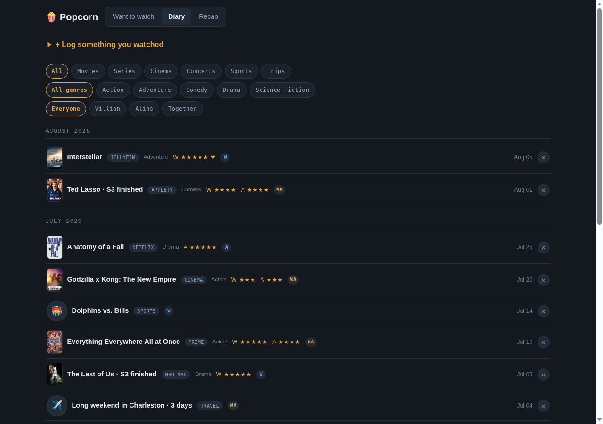
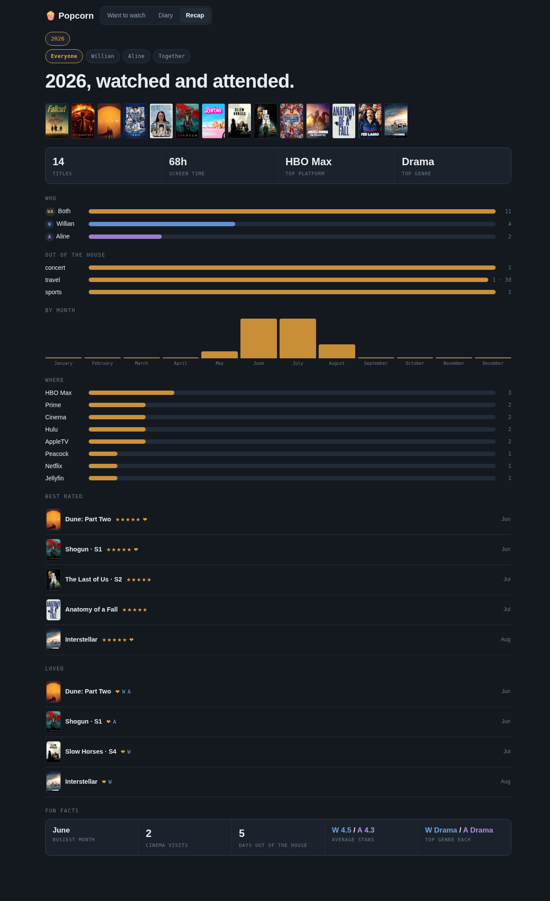

# Popcorn

A household's movie and series watchlist and watch diary, built around one
observation: wanting to watch something and having watched something are two
different lists, and most trackers conflate them. So Popcorn keeps three
tabs instead of one.

- **Want to watch**: search TMDB, pick a result, and the app decides for you
  whether that becomes a Jellyfin request or a plain watchlist entry, by
  checking where the title actually streams against the household's own
  subscriptions.
- **Diary**: what got watched, where, when, by whom, and how it was rated.
  Filled in automatically wherever it can be (a finished Jellyfin title, a
  calendar event), and by hand for everything else.
- **Recap**: a per-year "wrapped", built to be screenshotted: hours watched,
  top platform and genre, a poster shelf, best-rated, loved, and a few fun
  facts.

FastAPI, Postgres and Jinja templates. No ORM, no build step, no JavaScript
framework. It installs as a PWA on a phone.





*The diary. Filters compose: type, then genre, then who watched it. Ratings are
per person, so one person rating something never hides it from the other.*



## Try it

```sh
cp .env.example .env      # only POP_DB_PASSWORD needs a value
make demo                 # builds, starts, and loads a demo request queue and diary
```

Then open <http://127.0.0.1:3040>. The demo data in `demo/seed.sql` is
invented: a few months of a plausible household diary (movies, series by
season, a couple of cinema visits, a concert, a sports outing, a trip), rated
by both people with at least one title "loved" by each, plus a request queue
mixing open Jellyfin requests, one already available, and a couple of
watchlist entries for things already streaming somewhere. `make demo-reset`
puts it back.

Without TMDB, Jellyfin or calendar credentials configured, the request and
diary pages still work; only the automatic feeds and the add-by-search box
have nothing to talk to (see `.env.example` for exactly what each missing
variable disables).

## What is interesting in here

**Watchlist vs. request, decided by what you already pay for.** Picking a
TMDB result queries its US streaming providers and matches them against the
household's own service list (`MY_SERVICES` in `app/main.py`). A title
streaming on one of those becomes a watchlist entry tagged with that
service; everything else becomes a Jellyfin request. The distinction is not
cosmetic: a request gets checked against the Jellyfin library and pings
whoever asked for it once it lands, a watchlist entry never does, because
there is nothing for the app to fetch.

**Per-person ratings, and the option above five stars.** `rating_willian`
and `rating_aline` are separate columns, and the rate control on a diary row
only shows up for whichever of the two hasn't rated it yet: the moment you
rate something the select disappears for you and stays for the other person.
"Loved" is a fifth option beyond the star row, a heart on top of five stars,
stored as its own boolean per person (`loved_willian`/`loved_aline`) so the
recap can single those out separately from a merely five-star night. The
rating and the love both belong to whoever is logging in, never to "the
household", even when the entry itself says `who = 'Both'`.

**Diary filters that compose instead of resetting each other.** Type
(movies/series/cinema/concerts/sports/trips), genre, and person are three
independent GET-parameter dimensions; every chip link carries whatever the
other two are currently set to, so picking "Series" doesn't lose a genre or
person filter already in place. The same composition rules the recap's
person chips. Rating or deleting a row from a filtered view returns to that
same filter rather than dropping back to the unfiltered diary.

**TMDB matching for the automatic feeds.** A finished Jellyfin title is
looked up by name and year, not by any Jellyfin-side id, so a diary entry
survives a Jellyfin library rebuild. A calendar's Cinema event is matched
against TMDB search results by normalized-title containment rather than
taken on faith, because a first-guess match can be confidently wrong (a
one-off screening event with a title that isn't a real movie should get no
poster, not someone else's poster). Series requests track partial seasons
honestly: a request for "season 3" only flips to available when Jellyfin's
episode count for that season meets TMDB's expected count, not the moment a
single episode shows up.

**The gate only asks people who need it.** `app/gate.py` trusts loopback and
RFC1918/Tailscale-range traffic without a login screen, on the theory that
being on the home network already is the proof; only a request whose real
client address looks public gets a password prompt, and if the gate isn't
configured those visitors are refused rather than let in. The session cookie
and its secret are meant to be shared across a household's other apps (one
login, one cookie everywhere), and every URL a template emits is built from
`X-Forwarded-Prefix`, which is what lets the same deployment answer both on
its own port and as a path behind a router.

## Layout

```
app/main.py         routes, schema, TMDB proxy, the watchlist-vs-request rule
app/poller.py        the automatic feeds: Jellyfin finishes, request arrivals,
                     calendar events; each source is independently optional
app/gate.py          who is trusted, who needs a password
app/templates/       Jinja, phone-first CSS with a desktop breakpoint
demo/seed.sql        the invented request queue and diary used by `make demo`
docker-compose.yml   app + postgres, loopback-bound on purpose
```

The committed compose file binds to loopback only: a reverse proxy or a VPN
is meant to be the way in. Host-specific extras, another port or a LAN
address, belong in a `docker-compose.override.yml`, which is git-ignored.

Configuration is all in `.env.example`; the database password is the only
required variable, and everything else (TMDB, Jellyfin, the calendar feed,
Telegram, the login) is optional and degrades gracefully when left unset.

## Status

The design notes in [STATUS.md](STATUS.md) read like a running log of real
use: what was built, what friction from actual daily use changed, and what
is still approximate (season hours in the recap, Jellyfin title matching by
name and year).

## License

MIT, see [LICENSE](LICENSE).
